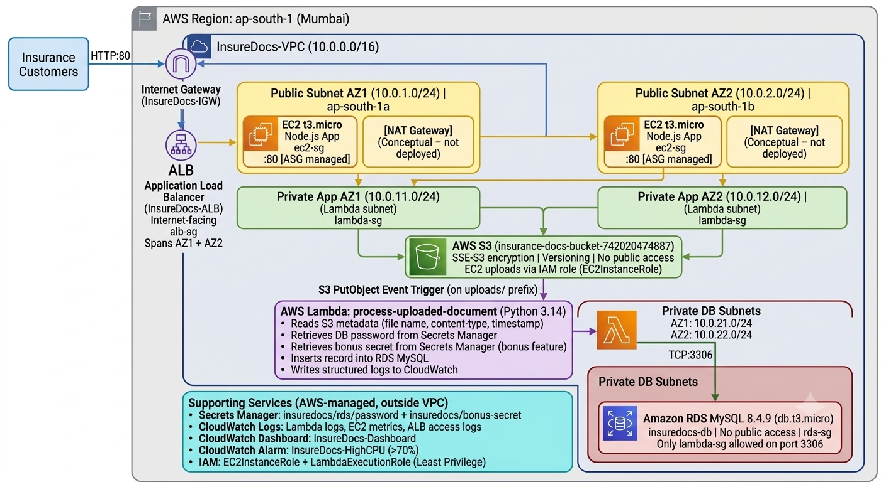

# 🛡️ InsureDocs – Self-Service Document Upload Portal
### NAGP Cloud Computing & N.S. Workshop – Case Study Submission
**Submitted by:** Piyush Chandel | **Account ID:** 742020474887 | **Region:** ap-south-1 (Mumbai)

---

## 📹 Demo Videos

| Deliverable | Link |
|---|---|---|
| **Running Application Demo** | https://drive.google.com/file/d/1540P2RPrbRCFMDXr-c5j8nxhW6lnMilb/view?usp=sharing |
| **AWS Configuration Walkthrough** | https://drive.google.com/file/d/10jwGC-JuZiiFeSgUzkZmzz4D6KXwdwvL/view?usp=sharing |

---

## 🏗️ Architecture Overview



<details>
<summary>Text representation</summary>

```
                    ┌──────────────────────────────────────────────────────┐
                    │           AWS Region: ap-south-1 (Mumbai)            │
                    │                                                        │
  Internet ──HTTP──►│  Internet Gateway                                      │
  Users             │       │                                                │
        ▲           │  Application Load Balancer (InsureDocs-ALB)           │
        │           │  Public Subnets: AZ1 (10.0.1.0/24) + AZ2 (10.0.2.0/24)│
        └───────────│       │                    │                           │
                    │  EC2 t3.micro          EC2 t3.micro                    │
                    │  Node.js (ASG)         Node.js (ASG)                   │
                    │  Public-AZ1            Public-AZ2                      │
                    │       │                    │                           │
                    │       └──── S3 Upload ─────┘                          │
                    │              │                                          │
                    │   insurance-docs-bucket-742020474887                   │
                    │              │ S3 Trigger (PutObject)                  │
                    │   Lambda: process-uploaded-document (Python 3.14)      │
                    │   VPC: Private-App subnets (10.0.11.0/24, 10.0.12.0/24)│
                    │              │ → Secrets Manager (DB password)         │
                    │              │ → CloudWatch Logs                       │
                    │              │ TCP:3306                                 │
                    │   RDS MySQL 8.4.9 (insuredocs-db)                      │
                    │   Private DB subnets (10.0.21.0/24, 10.0.22.0/24)     │
                    └──────────────────────────────────────────────────────┘
```

> **NAT Gateway** is depicted in the architecture diagram (`docs/architecture-diagram.md`) but not deployed due to Free Tier cost constraints (~$32/month). EC2 instances are in public subnets as a workaround.

</details>

---

## 📁 Project Structure

```
cloud/
├── README.md                            ← This file (submission document)
├── CONTEXT.md                           ← Implementation progress tracker
│
├── webapp/                              ← EC2-hosted Node.js web application
│   ├── app.js                           ← Express server – S3 upload handler
│   ├── package.json                     ← Node.js dependencies
│   └── public/
│       └── index.html                   ← Frontend UI – drag & drop upload
│
├── lambda/                              ← AWS Lambda serverless function
│   ├── lambda_function.py               ← Python handler (S3→RDS processor)
│   ├── lambda_package.zip               ← Deployment package (pymysql bundled)
│   └── requirements.txt                 ← Python dependencies
│
├── infrastructure/                      ← AWS configuration files
│   ├── ec2-userdata.sh                  ← EC2 bootstrap script (self-contained)
│   ├── ec2-trust-policy.json            ← IAM trust policy for EC2 role
│   ├── ec2-s3-policy.json               ← IAM policy: EC2 → S3 (least privilege)
│   ├── lambda-trust-policy.json         ← IAM trust policy for Lambda role
│   └── lambda-policy.json               ← IAM policy: Lambda (S3, RDS, SM, CW)
│
└── docs/                                ← Documentation & deliverables
    ├── architecture-diagram.md          ← Deliverable 1: Architecture diagram
    ├── component-description.md         ← Deliverable 2: Component descriptions
    ├── scope-and-assumptions.md         ← Deliverable 6: Scope & assumptions
    ├── deployment-guide.md              ← Step-by-step deployment instructions
    └── console-step-by-step.md          ← AWS Console walkthrough guide
```

---

## 🔧 AWS Services Used

| Service | Purpose | Key Config |
|---|---|---|
| **VPC** | Isolated network | 10.0.0.0/16, 6 subnets, 2 AZs |
| **Internet Gateway** | Internet access | Attached to InsureDocs-VPC |
| **ALB** | Load balancing | Internet-facing, HTTP:80, /health check |
| **Auto Scaling Group** | Dynamic scaling | Min:1, Desired:2, Max:4, CPU 70% |
| **EC2 (t3.micro)** | App hosting | Node.js + Express, Amazon Linux 2023 |
| **Amazon S3** | Document storage | SSE-S3, versioning, no public access |
| **AWS Lambda** | Event processing | Python 3.14, VPC, S3 trigger |
| **Amazon RDS MySQL** | Metadata storage | 8.4.9, db.t3.micro, private subnet |
| **Secrets Manager** | Credential storage | DB password + bonus secret |
| **CloudWatch** | Observability | Logs + Dashboard + Alarms |
| **IAM** | Access control | Least privilege roles & policies |

---

## 🎯 Deliverables

### 1. Cloud Architecture Diagram
📄 [`docs/architecture-diagram.md`](docs/architecture-diagram.md)
- VPC layout with all 6 subnets across 2 AZs
- Traffic flow from internet → ALB → EC2 → S3 → Lambda → RDS
- NAT Gateway shown conceptually

### 2. Component Description Document
📄 [`docs/component-description.md`](docs/component-description.md)
- Each AWS service, its purpose, security considerations, HA considerations

### 3. Running Application Demo *(2 min video)*
🎬 **Video:** *(Paste Google Drive link here)*
- Portal access via ALB URL
- File upload functionality
- File visible in S3
- Lambda execution in CloudWatch logs
- RDS entry creation

### 4. AWS Configuration Walkthrough *(8 min video)*
🎬 **Video:** *(Paste Google Drive link here)*
- IAM setup (users, groups, roles, policies)
- VPC setup (subnets, route tables, IGW)
- Security Groups & NACLs
- EC2, Launch Template, ASG, ALB
- S3 bucket configuration
- Lambda configuration & S3 trigger
- RDS configuration
- Key design decisions explained

### 5. Source Code
📄 All code in this repository:
- Web app: [`webapp/app.js`](webapp/app.js) + [`webapp/public/index.html`](webapp/public/index.html)
- Lambda: [`lambda/lambda_function.py`](lambda/lambda_function.py)
- Bootstrap: [`infrastructure/ec2-userdata.sh`](infrastructure/ec2-userdata.sh)

**Setup Instructions:**
```bash
# Local development
cd webapp
npm install
export S3_BUCKET_NAME=insurance-docs-bucket-742020474887
export AWS_REGION=ap-south-1
export PORT=3000
node app.js
```

**EC2 Deployment:** Handled automatically by `infrastructure/ec2-userdata.sh` via Launch Template.

**Lambda Deployment:** Upload `lambda/lambda_package.zip` to Lambda console.

### 6. Scope & Assumptions
📄 [`docs/scope-and-assumptions.md`](docs/scope-and-assumptions.md)

Key assumptions:
- Single region (ap-south-1) deployment
- NAT Gateway not deployed (Free Tier constraint — depicted in diagram only)
- EC2 instances placed in public subnets as NAT Gateway workaround
- HTTP only (no HTTPS — ALB DNS name doesn't support ACM certificates)
- RDS single-AZ (not Multi-AZ — Free Tier)
- MySQL 8.4.9 selected for broad compatibility

### 7. Bonus Activities
| Bonus | Status | Details |
|---|---|---|
| **Secrets Manager Integration** | ✅ | Lambda retrieves DB password AND bonus secret, logs to CloudWatch |
| **CloudWatch Dashboard** | ✅ | InsureDocs-Dashboard with EC2 CPU, Lambda invocations/errors, ALB requests |
| **CloudWatch Alarms** | ✅ | InsureDocs-HighCPU alarm (CPU > 70%) |

---

## 🔐 Security Design

| Control | Implementation |
|---|---|
| Network isolation | 3-tier: Public (ALB) → Public (EC2) → Private (DB) |
| Security Group chaining | ec2-sg: port 80 from alb-sg only; rds-sg: port 3306 from lambda-sg only |
| NACLs | nacl-public (HTTP/HTTPS only) + nacl-private-db (MySQL only) |
| No hardcoded credentials | DB password from Secrets Manager at Lambda runtime |
| S3 encryption | SSE-S3 (AES-256) on all objects |
| S3 access | Blocked all public access; IAM role only |
| RDS | No public access; private subnets only |
| IAM least privilege | EC2 can only PutObject; Lambda can only read metadata + write DB |

---

## 📈 Scalability & High Availability

| Feature | Implementation |
|---|---|
| Multi-AZ | ALB + EC2 ASG span ap-south-1a + ap-south-1b |
| Auto Scaling | CPU 70% target tracking → scales 1→4 EC2 instances |
| Health checks | ALB checks /health every 30s; unhealthy → replaced |
| S3 | 11 nines durability, inherently scalable |
| Lambda | Automatically scales concurrently per event |

---

## 🧹 Clean-Up

After demo recording, delete all resources:
1. ASG → ALB → Target Group → Launch Template
2. Lambda function
3. RDS instance (skip final snapshot)
4. S3: empty bucket → delete bucket
5. Secrets Manager: delete both secrets
6. CloudWatch: log groups + dashboard
7. VPC (auto-deletes subnets, SGs, NACLs, route tables, IGW)
8. IAM: roles → users → group → policies

---

*NAGP Cloud Computing & N.S. Workshop – Case Study | September 2026*
*Account: 742020474887 | Region: ap-south-1*
